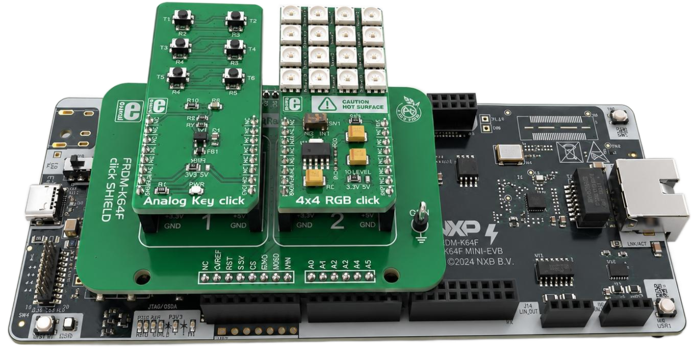
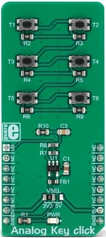
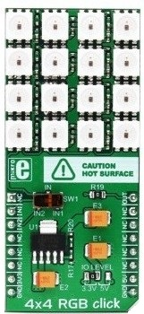
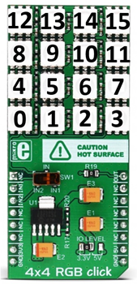

# NXP Application Code Hub

## Vehicle Lighting Control for Daylight and Hazard Signals
This demo demonstrates control of vehicle lighting systems using embedded peripherals. Daylight running lights and hazard signals are managed based on input conditions, with real-time feedback through LEDs. The example highlights how automotive lighting features can be implemented and tested on an embedded platform.

#### Boards: FRDM-A-S32K344
#### Categories: Touch Sensing
#### Peripherals: FlexIO, ADC
#### Toolchains: S32 Design Studio IDE

## Table of Contents
1. [Software and Tools](#step1)
2. [Hardware](#step2)
3. [Setup](#step3)
4. [Results](#step4)
5. [Support](#step5)
6. [Release Notes](#step6)

## 1. Software and Tools
This example was developed using the FRDM Automotive Bundle for S32K3. To download and install the complete software and tools ecosystem, use the following link: 
- [ S32K3 FRDM Automotive Board Installation Package](https://www.nxp.com/app-autopackagemgr/automotive-software-package-manager:AUTO-SW-PACKAGE-MANAGER?currentTab=0&selectedDevices=S32K3&applicationVersionID=156)

## 2. Hardware
### 2.1 Required Hardware
- Personal Computer
- Type-C USB cable

| Boards | Images |
| ----------- | ------- |
| - [FRDM-A-S32K344](https://www.nxp.com/design/design-center/development-boards-and-designs/S32K344MINI-EVB) |  |
| - [FRDM K64 click shield](https://www.mikroe.com/frdm-k64-click-shield) | 

 |
| - [Analog Key Click](https://www.mikroe.com/analog-key-click) - [4X4 RGB Click](https://www.mikroe.com/4x4-rgb-click) | 
 
 |

### 2.2 Hardware Connections
| FRDM-A-S32K344   | Header Pin |I/O| FRDM Shield  | Click Board   | Click Pin | Description  |
|------------------|------------|---|--------------|---------------|-----------|--------------|
| PTA13 FlexIO_D8  | J4 pin 5   | → | A2           | 4X4 RGB Click | IN1       | Data input 1 |
| GND              | JA3 pin 13 | → | GND          | 4X4 RGB Click | GND       | Ground       |
| VDD_PERH         | JA3 pin 7  | → | 3.3V         | 4X4 RGB Click | 3V3       | Power Supply |
| PTD1 ADC0_P0     | J4 pin 1   | ← | A0           | Analog Key Click   | AN0       | Analog Output|
| GND              | JA3 pin 11 | → | GND          | Analog Key Click   | GND       | Ground       |
| VDD_PERH         | JA3 pin 7  | → | 3.3V         | Analog Key Click   | 3V3       | Power Supply |

### 2.3 Debugger Connection
- Connect the Type-C USB cable to PC and FRDM-A-S32K344 board for power supply and debugging

## 3. Setup

### 3.1 Import the Project into S32 Design Studio IDE
1. Open S32 Design Studio IDE, in the Dashboard Panel, choose **Import project from Application Code Hub**.
[

](./images/import_project_1.png)

2. You can find the demo you need by searching for the name directly. Open the project, click the **GitHub link** from this window, S32 Design Studio IDE will automatically retrieve project attributes then click **Next>**.
[

](./images/import_project_3.png)

3. Select **main** branch and then click **Next>**.
4. Select your local path for the repo in **Destination->Directory** window. The S32 Design Studio IDE will clone the repo into this path, click **Next>**.

5. Select **Import existing Eclipse projects** then click **Next>**.

6. Select the project in this repo (only one project in this repo) then click **Finish**.
### 3.2 Generating, Building and Running the Example
1. In Project Explorer, right-click the project and select **Update Code and Build Project**. This will generate the configuration (Pins, Clocks, Peripherals), update the source code and build the project using the active configuration (e.g. Debug_FLASH).
Make sure the build completes successfully and the *.elf file is generated without errors.
[

](./images/update_and_build.png)
Press **Yes** in the **SDK Component Management** pop-up window to continue.

2. Go to **Debug** and select **Debug Configurations**. There will be a debug configuration for this project:
[

](./images/Debug_config.png)

        Configuration Name                  Description
        -------------------------------     -----------------------
        $(example)_debug_flash_pemicro      Debug the FLASH configuration using PEmicro probe

    Select the desired debug configuration and click on **Debug**. Now the perspective will change to the **Debug Perspective**.
    Use the controls to control the program flow.

## 4. Results
The RGB Click board is controlled by the Analog Click board to simulate a complete vehicle lighting system. Upon startup, all LEDs perform a test sequence displaying sequential white activation followed by red, green, and blue color cycles to verify proper functionality.

During normal operation, the six analog buttons command the RGB LED Click  to display different automotive lighting patterns: warm white for low beam headlights, cool white for high beams, amber blinking patterns for turn signals and hazard lights, and red for brake lights. The analog voltage input from each button press is measured through ADC conversion with debouncing, triggering the corresponding LED pattern on the RGB strip. The system replicates authentic automotive behavior including safety interlocks and continuous turn signal blinking, providing real-time visual feedback of a functional vehicle lighting control system.
By pressing the buttons on the Analog Key Click, the LEDs on RGB Click will be turned on in the following specific way:

[

](./images/results.gif)

The RGB Click has the following LED mapping:
[

](./images/4x4-rgb-click-mapped.png)

### Button T1: Low Beam Headlights
- **LEDs Controlled**: 13, 14
- **Color**: Warm White
- **Function**: Toggles low beam headlights ON/OFF for standard night driving illumination
- **Notes**: Turning OFF low beam automatically disables high beam for safety. Required to be ON before high beam can be activated

### Button T2: High Beam Headlights
- **LEDs Controlled**: 8, 9, 10 ,11
- **Color**: Cool White
- **Function**: Toggles high beam headlights ON/OFF for enhanced long-range visibility
- **Notes**: Can only be activated when low beam is already ON. Remains active during turn signal blinking

### Button T3: Left Turn Signal
- **LEDs Controlled**: 0, 12
- **Color**: Amber (Blinking)
- **Function**: Toggles left turn indicator with continuous blinking pattern
- **Notes**: Independent operation with no interaction with other lighting systems

### Button T4: Right Turn Signal
- **LEDs Controlled**: 3, 15
- **Color**: Amber (Blinking)
- **Function**: Toggles right turn indicator with continuous blinking pattern
- **Notes**: Independent operation with no interaction with other lighting systems

### Button T5: Brake Lights
- **LEDs Controlled**: 1, 2, 5, 6
- **Color**: Red
- **Function**: Toggles brake lights ON/OFF to simulate braking action
- **Notes**: Independent operation with no interaction with other lighting systems

### Button T6: Hazard Lights
- **LEDs Controlled**: 0, 3, 12, 15
- **Color**: Amber (Blinking)
- **Function**: Activates emergency flashers by enabling both left and right turn signals simultaneously with synchronized blinking
- **Notes**: All four LEDs blink in unison. High beam state is preserved and restores during blink OFF phase if active

## 5. Support
For general technical questions related to NXP microcontrollers, please use the *NXP Community Forum*.
#### Project Metadata

<!----- Boards ----->

<!----- Categories ----->

<!----- Peripherals ----->

<!----- Toolchains ----->

Questions regarding the content/correctness of this example can be entered as Issues within this GitHub repository.

>**Warning**: For more general technical questions regarding NXP Microcontrollers and the difference in expected functionality, enter your questions on the [NXP Community Forum](https://community.nxp.com/)

## 6. Release Notes
| Version | Description / Update                           | Date                        |
|:-------:|------------------------------------------------|----------------------------:|
| 1.0     | Initial release on Application Code Hub        | May 7th 2026     |